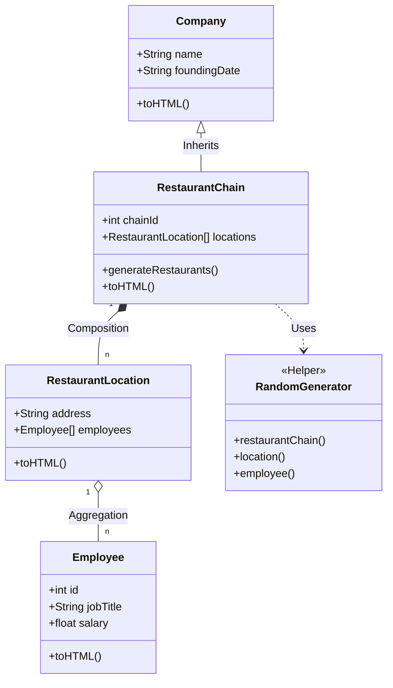

# Restaurant Chain Mock System

## 1. プロジェクト名
**Restaurant Chain Mock System**

## 2. 概要
本プロジェクトは、オブジェクト指向プログラミング（OOP）の原則に基づき、架空の飲食店チェーン（Restaurant Chain）とその店舗、従業員データを動的に生成・管理・可視化する PHP アプリケーションです。

ランダムなデータ生成ロジックを用いて、実行ごとに異なる企業構造や人員構成をシミュレーションし、HTML として構造化データを出力します。

## 3. 特徴
*   **動的なデータ生成**: `RandomGenerator` ヘルパーを使用し、企業名、所在地、従業員情報をリアルタイムに生成。
*   **階層的なオブジェクト構造**: 企業 (Company) > チェーン (Chain) > 店舗 (Location) > 従業員 (Employee) という明確な階層関係を実装。
*   **OOP の実践**: 継承、コンポジション、カプセル化といった基本的なオブジェクト指向設計を採用。
*   **視覚的なデータ表現**: 生成された複雑なオブジェクトグラフを、可読性の高い HTML レポートとしてレンダリング。

## 4. このプロジェクトを通して学べること・習得できること

このプロジェクトは、単なるデータ表示アプリではなく、**堅牢なバックエンド設計の基礎**を学ぶためのサンドボックスです。

### 🛠 技術的スキル
*   **PHP オブジェクト指向設計 (OOP)**:
    *   **継承 (Inheritance)**: `Company` クラスを基底とし、`RestaurantChain` が拡張する設計を通じて、共通ロジックの再利用と特化の実装を学びます。
    *   **コンポジション (Composition)**: チェーンが複数の店舗を持ち、店舗が複数の従業員を持つ「Has-a 関係」の適切なモデリングを習得します。
    *   **依存性の注入と分離**: データ生成ロジック（`RandomGenerator`）をドメインクラスから切り離す設計判断を学びます。

### 🧠 アーキテクチャ・設計思考
*   **ドメインモデリング**: 現実世界の「飲食店経営」という事象を、属性（プロパティ）と振る舞い（メソッド）に落とし込む抽象化能力を養います。
*   **責務の分離 (SoC)**:
    *   データの保持（Entity）
    *   データの生成（Factory/Helper）
    *   データの表示（View/Presentation）
    これらの責務が混在しがちなコードを、どのようにリファクタリングして分離するかを実践的に学びます。
*   **データ整合性の管理**: 親会社と店舗数、店舗と従業員数など、オブジェクト間の整合性を保つためのコンストラクタ設計やバリデーションロジックを習得します。

### 📊 概念図 (Class Diagram)



## 5. 必要条件
*   **PHP**: 7.4 以上 (8.x 推奨)
*   **Web Server**: PHP Built-in Server, Apache, または Nginx

## 6. インストール手順
プロジェクトをローカル環境にセットアップするには、以下の手順に従ってください。

### リポジトリのクローン
```bash
git clone <repository-url>
cd restaurant-system
```

### 依存関係の確認
標準ライブラリのみを使用しているため、`composer install` 等は不要です。

## 7. 使用方法
PHP のビルトインサーバーを使用して、すぐに動作を確認できます。

### サーバーの起動
プロジェクトのルートディレクトリで以下のコマンドを実行します。

```bash
php -S localhost:8000
```

### ブラウザでアクセス
ブラウザを開き、以下の URL にアクセスします。
[http://localhost:8000](http://localhost:8000)

画面をリロードするたびに、新しいレストランチェーンのデータが生成・表示されます。

## 8. 機能一覧
*   **チェーン生成**: ランダムなジャンル、設立年を持つレストランチェーンを作成。
*   **店舗展開**: チェーンごとに 2〜5 店舗のロケーションを自動生成。
*   **従業員配置**: 各店舗にランダムな役職・給与を持つ従業員を配置。
*   **HTML レポート**: 全階層のデータをアコーディオンやリスト形式（実装依存）で表示。

## 9. 技術スタック
*   **Language**: PHP 8.x
*   **Frontend**: HTML5, CSS3 (Bootstrap 等のフレームワークが含まれる場合あり)
*   **Tools**: Git, Visual Studio Code

## 10. 追加資料
*   [PHP オブジェクト指向プログラミング入門](https://www.php.net/manual/ja/language.oop5.php)
*   [Markdown 記法ガイド](https://www.markdownguide.org/)

## 11. 貢献方法
本プロジェクトへの貢献を歓迎します。

1.  このリポジトリを Fork してください。
2.  新しいブランチを作成します (`git checkout -b feature/amazing-feature`)。
3.  変更をコミットします (`git commit -m 'Add some amazing feature'`)。
4.  ブランチを Push します (`git push origin feature/amazing-feature`)。
5.  Pull Request を作成してください。

## 12. ライセンス
本プロジェクトは MIT License の下で公開されています。

